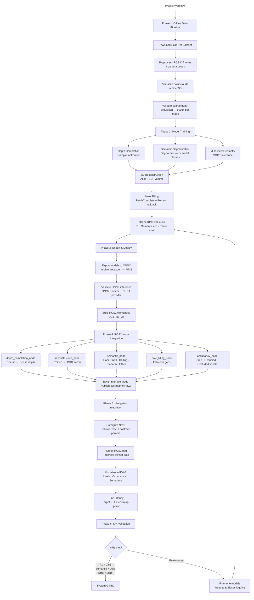
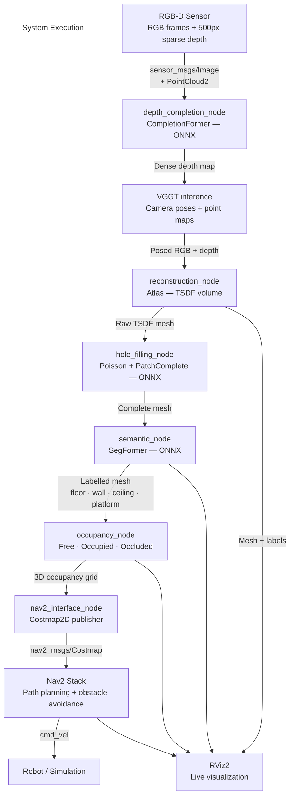

## Rough FLowchart

# Occlusion-Aware 3D Reconstruction & Navigation System

> Occlusion-aware 3D scene reconstruction from sparse RGB-D data, with semantic classification and safe autonomous navigation using ROS2 and deep learning.

---

# Table of Contents
- [Problem Statement](#problem-statement)
- [Key Deliverables](#key-deliverables)
- [KPI Targets](#kpi-targets)
- [Project Workflow](#project-workflow)
- [System Execution](#system-execution)
- [Tech Stack](#tech-stack)
- [Repository Structure](#repository-structure)
- [Getting Started](#getting-started)
- [Datasets & Models](#datasets--models)

---

# Problem Statement

Modern autonomous systems rely on sensor data to build 3D scene models for navigation. Real-world environments are **inherently partially observable**, leading to:

- **Occluded obstacles** — objects hidden behind furniture create blind spots
- **Incomplete maps** — limited viewpoints cause gaps in 3D reconstruction
- **Navigation risks** — missing geometry can cause collisions with unseen hazards
- **Mesh holes** — sparse sensor data produces fragmented 3D representations

Traditional mapping systems assume full visibility and **fail to infer occluded regions**. This system addresses that gap.

---
# Deliverables

| # | Deliverable | Description |
|---|---|---|
| 1 | **Occlusion-Aware Reconstruction** | Complete 3D mesh from ~500px sparse depth + RGB |
| 2 | **Scene Classification** | Free / Occupied / Occluded space + semantic labels |
| 3 | **Hole-Filling Algorithm** | Geometrically plausible mesh completion |
| 4 | **Nav2 Integration** | Safe path planning using reconstructed scene |

---
# KPI Targets

| Metric | Target | Baseline |
|---|---|---|
| F1 score — filled 3D mesh | **> 0.95** | 0.85 |
| Semantic classification accuracy | **> 90%** | 80% |
| Reconstruction accuracy | **< 2 cm** | 5 cm |

---
# Project Workflow

---
# System Execution

---
